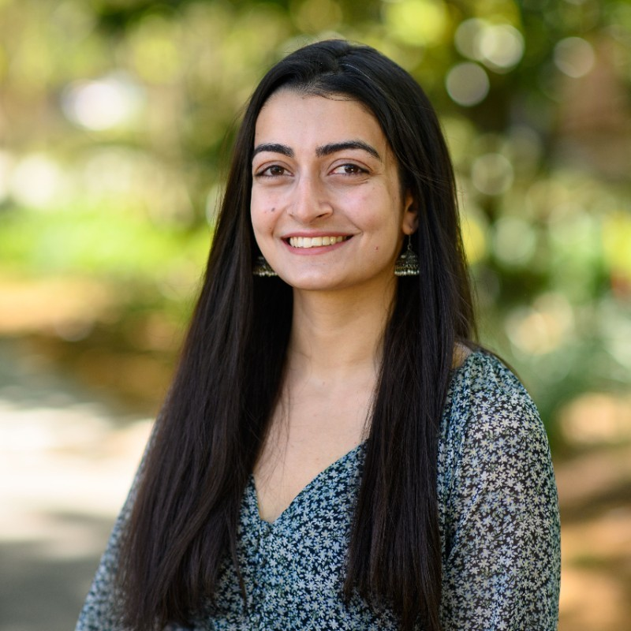

# Nimra Nadeem

  

Email: nimra.nadeem.ahmad@gmail.com

LinkedIn: https://www.linkedin.com/in/nnadeem20/

I am a Software Engineer in the Bloomberg Law department at Bloomberg LP. I graduated *Magna Cum Laude* from Princeton University with a Bachelors of Arts (A.B.) in Computer Science and a certificate in [Values and Public Life](https://uchv.princeton.edu/academic-programs/values-and-public-life) in 2021. Below is some of the research and writing I did during my undergraduate years.

## Research and Writing

### Technical Papers

- [*Learning To Breathe: Physics v. ML-based Lung Simulations for Control of Medical Ventilators*](files/senior_thesis_nnadeem.pdf), *2021*. Advised by Professor [Elad Hazan](https://www.ehazan.com/). Cited by [Suo et al. (2021)](https://arxiv.org/abs/2102.06779).

- [*Multi-dimensional Rewards are Unnecessary in Deterministic Environments*](files/junior_research_spring_20.pdf), *2020*. Advised by Professor [Tom Griffiths](https://cocosci.princeton.edu/tom/index.php).

- [*Effect of introducing context on the temporal dynamics of an ECoG based semantic encoding model*](files/junior_research_fall_19.pdf), *2020*. Advised by Professor [Uri Hasson](https://hassonlab.princeton.edu/people/uri-hasson).

- [*Spatial representations of similarity between countries*](files/cos_360_final_project.pdf), *2020*. Advised by Professor [Tom Griffiths](https://cocosci.princeton.edu/tom/index.php).

- [*Elevation, Aspect and Slope Do Not Effect the Rate of Vegetation Recovery Following a Wildfire*](files/sophomore_geo_research.pdf), *2019*. Advised by Professor [Adam Maloof](https://geosciences.princeton.edu/people/adam-maloof) and Professor [Amanda Irwin Wilkins](https://odoc.princeton.edu/about/who-we-are/amanda-irwin-wilkins).

### Non-Technical Papers

- [*Mera Jism Kiski Marzi? An Ethnographic Understanding of the Aurat (Women’s) March in Pakistan*](files/VPL_research_nnadeem.pdf), *2021*. Advised by Professor [Stephen Macedo](http://www.princeton.edu/~macedo/).

- [*The Racist Liberal Humanist: Black Plasticity and the Self/Other dialectic in Jordan Peele's Get Out*](files/wri_sem_paper.pdf), *2018*. Advised by Professor [Marina Fedosik](https://writing.princeton.edu/about/people/writing-seminar-faculty/marina-fedosik).

## Teaching Experience

- [**Inspirit AI**](https://www.inspiritai.com/): Course Instructor for the [AI Scholars Program](https://www.inspiritai.com/liveonline).  06/2022 – 09/2022.

- [**Ashinaga**](https://www.ashinaga.org/en/): Education Intern/English Teacher. 06/2018 – 08/2018

- [**Shree Mangal Dvip Boarding School**](https://himalayanchildren.org/): Science and Math Teacher. 08/2017-12/2017

